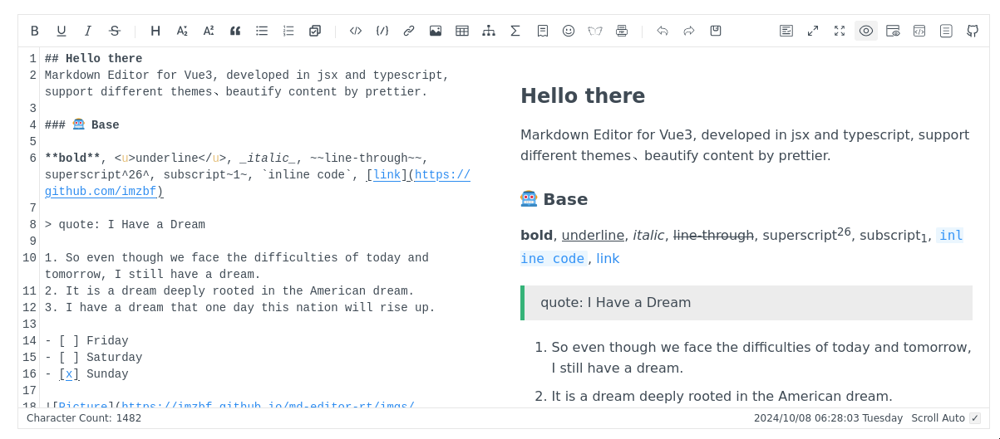

[Md editor v3](https://github.com/imzbf/md-editor-v3) will be used to embed a iframe based markdown editor. It's specifically made for the Vue framework and neatly integrates with just one component. I has a live preview of the content and even buttons to edit text, which helps user that may not be familiar with _markdown_.  
It also has support for theming.  
A live example can be [viewed here](https://imzbf.github.io/md-editor-v3/en-US/index)

