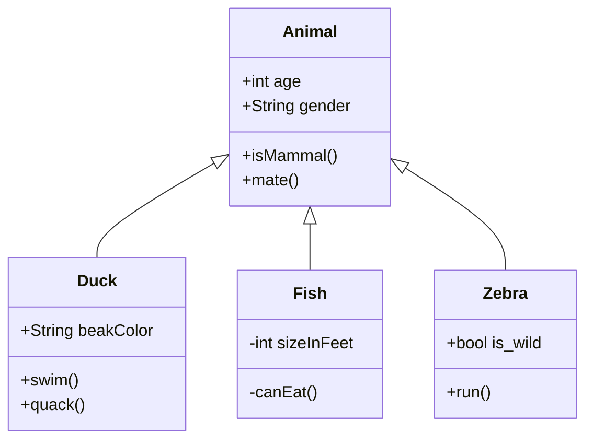

[Md editor v3](https://github.com/imzbf/md-editor-v3) will be used to embed a iframe based markdown editor. It's specifically made for the Vue framework and neatly integrates with just one component. It has a live preview of the content and even buttons to edit text, which helps users that may not be familiar with _markdown_.  
It also has support for theming.  
A live example can be [viewed here](https://imzbf.github.io/md-editor-v3/en-US/index)


## Features

MD-editor-v3 comes with a lot of features we are already familiar with. By default markdown doesn't support mermaid, latex and katex. But this library includes all these already embedded into the editor.  
Therefore we can display complex mathematical equations with latex like this:

```math
 \pi_{SName, GPA} (\gamma_{HS>100 ^ \text {major} = \text {cs} ^ \text{ dec} = \text { rejected }}( \text {GPA} \bowtie \text{ Apply}) )

```

With the help of mermaid we can display a handful of diagrams, naming a few such as ER diagram, class diagram, Sequence and much more.



## Easy implementation

Embedding this into our application is no hard task. [We can use this example](https://github.com/imzbf/md-editor-v3/blob/develop/example/nuxt/app.vue) in our Vue frontend.
All we need is a state that react to changes, and can be passed into the component. Any changes the user makes will be instantly stored and later can be sent back to the server with a http client like axios.

```js
try {
  const dataToSend = this.$refs.inputRef.value;
  const response = await axios.post("https://example.com/api/data", {
    data: dataToSend,
  });
  console.log("Data sent successfully:", response.data);
} catch (error) {
  console.error("Error sending data:", error);
}
```
